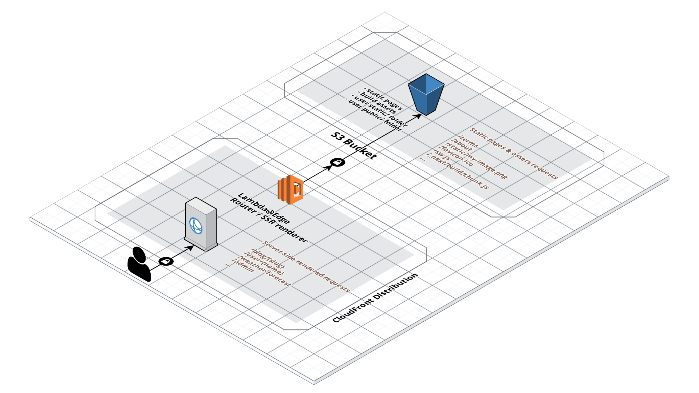

# Serverless Nextjs Component

A zero configuration Nextjs 9.0 [serverless component](https://github.com/serverless-components/) with full feature parity.

[](http://www.serverless.com)
[](https://travis-ci.org/danielcondemarin/serverless-nextjs-plugin)
[](https://opencollective.com/serverless-nextjs-plugin) [](https://badge.fury.io/js/serverless-nextjs-plugin)
[](https://coveralls.io/github/danielcondemarin/serverless-nextjs-plugin?branch=master)
[](https://www.codacy.com/app/danielcondemarin/serverless-nextjs-plugin?utm_source=github.com&utm_medium=referral&utm_content=danielcondemarin/serverless-nextjs-plugin&utm_campaign=Badge_Grade)

## Contents

- [Motivation](#motivation)
- [Design principles](#design-principles)
- [Features](#features)
- [Getting started](#getting-started)
- [Custom domain name](#custom-domain-name)
- [Fast SSR with Lambda@Edge](#Fast-SSR-with-Lambda@Edge)
- [Deploying the SSR API onto your existing API Gateway](#deploying)
- [Architecture](#architecture)

### Motivation

Since Nextjs 8.0, [serverless mode](https://nextjs.org/blog/next-8#serverless-nextjs) was introduced which provides a new low level API which projects like this can use to deploy onto different cloud providers. This project is a better version of the [serverless plugin](https://github.com/danielcondemarin/serverless-nextjs-plugin) which focuses on addressing core issues like [next 9 support](https://github.com/danielcondemarin/serverless-nextjs-plugin/issues/101), [better development experience](https://github.com/danielcondemarin/serverless-nextjs-plugin/issues/59), [the 200 CloudFormation resource limit](https://github.com/danielcondemarin/serverless-nextjs-plugin/issues/17) and [performance](https://github.com/danielcondemarin/serverless-nextjs-plugin/issues/13).

### Design principles

1. Zero configuration by default

There is no configuration needed. You can extend defaults based on your application needs.

2. Feature parity with nextjs

Users of this component should be able to use nextjs development tooling, aka `next dev`. It is the component's job to deploy your application ensuring parity with all of next's feature we know and love.

3. Fast deployments / no CloudFormation resource limits.

With a simplified architecture and no use of CloudFormation, there are no limits to how many pages you can have in your application, plus deployment times are very fast! with the exception of CloudFront propagation times of course.

### Features

- [x] [Server side rendered pages](https://github.com/zeit/next.js#fetching-data-and-component-lifecycle). Pages that need server side compute to render are hosted on AWS Lambda. The component takes care of all the routing for you so there is no configuration needed. If you want blazing fast response times check out the [lambda@edge](#Fast-SSR-with-Lambda@Edge) section below.
- [x] [Dynamic pages / route segments](https://github.com/zeit/next.js/#dynamic-routing).
- [x] [Automatic prerendering](https://github.com/zeit/next.js/#automatic-prerendering). Statically optimised pages compiled by next are served from CloudFront edge locations with low latency and cost.
- [x] [Client assets](https://github.com/zeit/next.js/#cdn-support-with-asset-prefix). Nextjs build assets `/_next/*` served from CloudFront.
- [x] [User static / public folders](https://github.com/zeit/next.js#static-file-serving-eg-images). Any of your assets in the static or public folders are uploaded to S3 and served from CloudFront automatically.

### Getting started

Add your next application to the serverless.yml:

```yml
# serverless.yml

myNextApplication:
  component: @serverless/nextjs
```

And simply deploy:

```bash
$ serverless
```

### Custom domain name

In most cases you wouldn't want to use CloudFront's distribution domain to access your application. Instead, you can specify a custom domain name:

```yml
# serverless.yml

myNextApplication:
  component: @serverless/nextjs
  inputs:
    domain: myfrontend.example.com
```

### Fast SSR with Lambda@Edge

If you have high demand server side rendered pages, you can opt-in to render them at the CloudFront edge locations. This will result in very lowest latency times by saving 2 hops and serving the user request from a close location to them. Due to current limitations in Lambda@Edge it is recommended that you turn this on a page per page basis and make sure you are not hitting any [limits](https://docs.aws.amazon.com/AmazonCloudFront/latest/DeveloperGuide/cloudfront-limits.html#limits-lambda-at-edge). Note the component uses the `origin request` event.

Enable this functionality by setting the `edge` property for your page(s):

```yml
# serverless.yml

myNextApplication:
  component: @serverless/nextjs
  inputs:
    domain: myfrontend.example.com
    pages:
	 - home:
	   edge: true
```

### Deploying the SSR API onto your existing API Gateway

If you already have a provisioned REST API and want to deploy the next application to it, use the `ssrApiId` option:

```yml
# serverless.yml

myNextApplication:
  component: @serverless/nextjs
  inputs:
    ssrApiId: qwerty
```

### Architecture

The application architecture deployed by the component is the following with minor variations:


